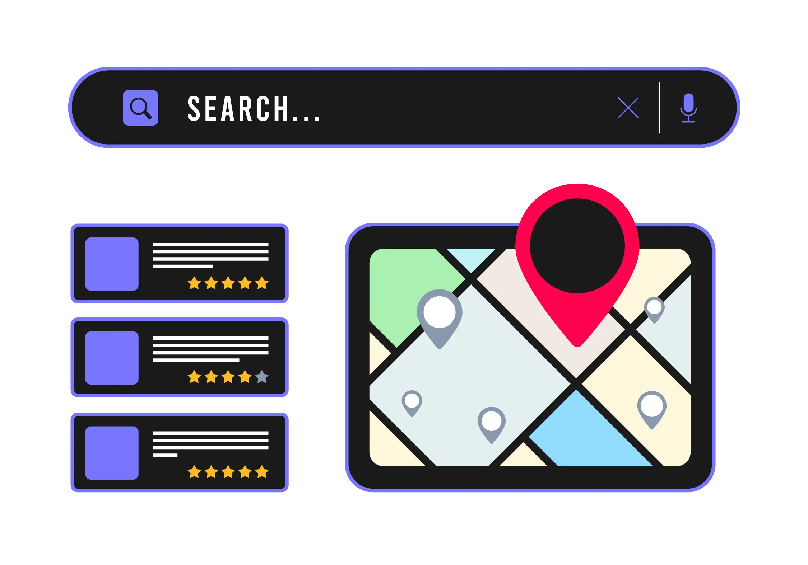

## Introduction

Before you had a website, you were reliant on other online networks to reach your customers. All these hopefully led to a phone call, but there was always one thing out of your hands – **control**. You have no leadership over constantly changing algorithms, and little control over how people interact with your business online. The one place you have almost complete control? **Your own website**.
    
Anyone who wants to build a **strong** online presence and build their brand on their own terms will want a visually appealing, smoothly functioning website. It’s essential to any business.
    
Located in beautiful Burlington, Ontario, RVB Data Sciences has the **tools** to help you thrive, no matter what you’re looking for. Need a **portfolio** website up stat? We’ll make it perfect – and that’s a stat! Just ask our other clients. We’re here to help with **online storefronts** and other **e-commerce solutions**, too. 

**With more than 15 years of experience in web development**, we’re prepared to help our clients reach their goals. Of course, web development is only one of our services: we also offer Web Hosting Solutions, Search Engine Optimization Solutions, Google Business Management and Business Process Automation.

**Here’s an in-depth look at our five key services.**

## Web Development – the GTA thrives online, and you can too

---

Do you prefer a simple template-based site, or a custom website design? We’re here for both. Using key tools and CMS like **Astro** and **WordPress**, we can craft something that best reflects your business and brand image. It’s all *tailored* to your needs and preferences, meaning no basic solutions or Band-Aids on those web development hiccups.
    
Anyone can make a website, but RVB makes a website like no other – especially when it comes to **longevity**. Your website is always scalable once you’ve outgrown its size and functionality. We’ll make it as big as your vision, so your site will be more than ‘live’ – it’ll be alive and functioning swiftly.

Content management is a major part of the puzzle. To keep your website buzzing with activity (or on its way to doing so), it will need regular **maintenance** to manage your website’s content. That’s adding brand-new pages, creating blogs with tailored keywords, and knowing the optimal place for content on your site. More on that later…

Remember that point we made about ‘longevity’? Once your site is live, **we’ll keep it that way**. As an RVB client, we offer ample post-launch support, fixing any issues and ensuring your site is performing swiftly and smoothly. 

The internet is always changing – that’s why we don’t believe in ‘mission accomplished’.

## Web Hosting Solutions – made in Burlington, lives in a secure server

---

You’ve approved your new site design and you’re ready to roll … but what’s point of having a website designed and full of content if it isn’t up and running? RVB Data Sciences offers [ample web hosting solutions](/web-hosting), including website migration, so your content can stay firmly where it belongs – on your brand-new site. It’s one less step you’ll have to take when launching your website.

Your website isn’t the only thing floating around the internet. **Viruses**, **virtual threats**, and **spam** lurk around your site. Our servers are located in secure data centres that comply with industry standards, keeping your ‘online business headquarters’ **safe** from harm. That includes firewalls, DDoS protection, and malware scanning and removal.

RVB even **provides automatic back-ups of your website files** to prevent data loss, and an SSL certificate is included with all our hosting plans. If you need ‘deleted’ transactional data, important files, and other sensitive information now, we’ll make sure you have it. Plus, that SSL encryption will make sure that information doesn’t fall into the wrong hands.

Of course, issues can occur with web hosting. If your site goes down, you could **miss** out on sales and opportunities. That’s why RVB Data Sciences offers a **99.9% uptime guarantee**. Your customers will be able to access your site when they need to most. And, with **24/7 tech support**, there’s no time of day we can’t work on downtime issues.

## Search Engine Optimization (SEO) – sway Google and Bing and let your content sing

---

Just because your site is hosted and live doesn’t mean it will be seen in search engines. There are *hundreds* of factors that decide the site that appears as the coveted number one search result. It’s impossible to guarantee number one … but having the right content in the right place is an excellent start to building your brand and business online. That’s something you can’t leave to a less experienced team.

RVB Data Sciences will improve your visibility online by using **clean Search Engine Optimization (SEO) tactics**. A massive part of that is the use of keywords in your content, which allow search engine users to find you with ease. We’re always researching new keywords to take your site to new heights and attract fresh organic traffic.

But where does that content come from, and where do the keywords go? We are happy to provide **SEO-friendly web copy** and professionally written blogs to all our clients. It’s the perfect option for local businesses who want to show they’re experts on any subject – and **nothing** goes up without your approval.

Speaking of local businesses, we specialize in **local SEO** to make sure you’re reaching customers in your city. Whether you’re located in the GTA or elsewhere in Canada, we’ll help you reach them. Just ask our two clients in **Windsor and Essex** County.

Other SEO tactics we use include fully optimized website elements, including **meta tags** and **headings**, building **back-links** to your website, and tuning your website for faster site speed, mobile-friendliness, and schema mark-up. As a matter of fact, **ALL** our websites are designed to be mobile friendly. It’s perfection in your pocket.

## Google Business Management – Keep customers old and new in the know

---

We’ve established that search engines are a big part of customers finding you online … but even with all the search engine optimization and content in the world, what’s there to find? Google search wants to find your business profile, showing your hours, reviews, and updates, as will potential customers. 

**Local retail locations** will find it difficult to survive without having a Google Business profile with regular upkeep in the case of **holidays**, **events**, and **relocations**. We’ll work with you to bring it to life and keep it that way.

We also integrate **Google Analytics** to help you track analyze website traffic to see what’s working *best* for your business. That lets you make **data-driven** decisions and leaves guessing on the cutting room floor.

And if organic search engine optimization isn’t cutting the mustard, we offer **Google Ads management**, too … managed by us. As the goal is to drive traffic to your website and improve your online visibility, paid search can be faster than organic. We’ll help you decide your next steps.

## Business Process Automation – you deserve efficiency

---

What’s more *valuable* than having the perfect website? Few things are as important as **time**. That’s time you could spend running your business and attracting clients. RVB wants you to have **as much time as possible** – made possible by our business process automation services. But what can we do to flip the hourglass?

No two businesses operate the same. If we offered the same automation solutions to two clients, one would fail. That’s why our solutions are always **custom** instead of cookie-cutter. We begin with a process analysis of your existing systems to identify all areas we can **improve** them.

Automation means **efficiency**, **improved accuracy**, and **scalability** – the perfect way to drive growth and transform the way you do business online. Our automated task management systems use **real-time analytics** to help you make informed, data-driven business decisions. Much like the web development side of our business, everything is scalable, too. **We’ll grow with you**.

Want to connect your systems and applications together? Our **API development services** can do just that. Need to integrate your existing systems with our services? Expect a **smooth** transition that maximizes all the benefits of automation. Best of all, we provide customer support around the clock for all our services – including your website designed by RVB – so if you have any problems, we’re there with answers.

## Bring your dreams to life without the strife

---

We serve Toronto, Burlington, Guelph, Milton, Hamilton, Oakville, Mississauga, and other Canadian cities with **pride** and **expert knowledge**. Though we’re the *new* web development agency based in Burlington, we’re <u>anything</u> but amateurs. We’re the answer to bringing your business online, whether you have an existing website or not.

