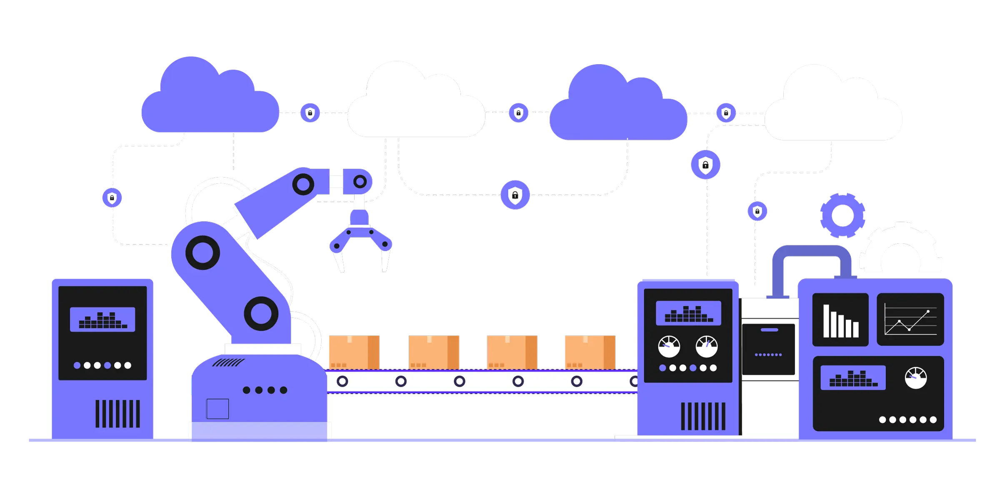

## Introduction

There’s a tool available from RVB that will give you a distinct advantage over competitors – it saves you more of life’s most valuable resource: **time**.

Business Process Automation (BPA) is where **advanced** technology meets **convenience** – a computer program designed to handle basic business processes without need for a human to complete those tasks. Instead of *replacing* an employee, BPA is designed to *assist* them with those mundane and tedious tasks. That includes onboarding employees and customers, IT services, and low-level marketing tasks.

## Here are the tasks RVB Data Sciences can automate for your business:

---

### Automate Manufacturing Processes
Supply chain? Quality assurance? **Everything** can be automated. Why send an email to your vendors every time you need parts? Once you get to certain stock levels, we can automatically generate a PO and send it away. Need to approve it? We can add that step. <u>There are not many limitations.</u>

### Customer Inquiries
Automation answers basic questions and **streamlines** the rest. Want to direct their tech questions to your IT support specialist? AI chat-bots and automated directories make this easy. We tune the AI program to match your operations. 

### CRMs, Finance, HR, and Many Other Operations
All of these systems can be integrated. You can have invoices, services tickets, company details, product details, email history chains, benefits, and a plethora of other important information **in one area**. This not only saves time but also ensures accuracy and consistency in your business operations. 

### Compliance and Reporting
Automating compliance reporting allows companies to **accurately** and **efficiently** collect data, generate reports, and ensure timely submissions to regulatory bodies. Automated systems also improve **audit readiness** by maintaining detailed records, provide real-time monitoring to prevent violations, and reduce operational costs. 

### Systems Integration 
Integrating systems, such as connecting a Shopify store to a CRM, streamlines business operations by automating the **flow of data** between platforms. This integration ensures that customer information, order details, and inventory levels are **automatically** updated across both systems, **reducing** manual data entry and the risk of **errors**. 

## Extra Resources
For more details on the benefits of business process automation, read through this blog by Penneo – it’s stuffed with plenty of great [benefits to automating processes](https://penneo.com/blog/10-benefits-business-process-automation/)

Also read this in-depth look at [IT infrastructure automation](https://www.maximaconsulting.com/newsroom/it-infrastructure-automation).

## What are the benefits to working with RVB?

---
Working with RVB is always the first step to bringing your business to a new level of **efficiency**. But what is it that we do <u>differently</u>? 
Our development services make it easy to connect your existing applications and systems together. That means data exchange is seamless. We communicate with you to make sure the integration is just the way you like it.  

We serve Toronto, Burlington, Guelph, Milton, Hamilton, Oakville, Mississauga, and other Canadian cities with **expert** automation solutions and more. <u>With more than 10 years of experience</u> in our craft, we ensure you receive the best result. [Visit our contact us page](https://rvbcorp.com/contact) and send us a message. We’d love to **elevate** your business and make it that much more **efficient**. 

