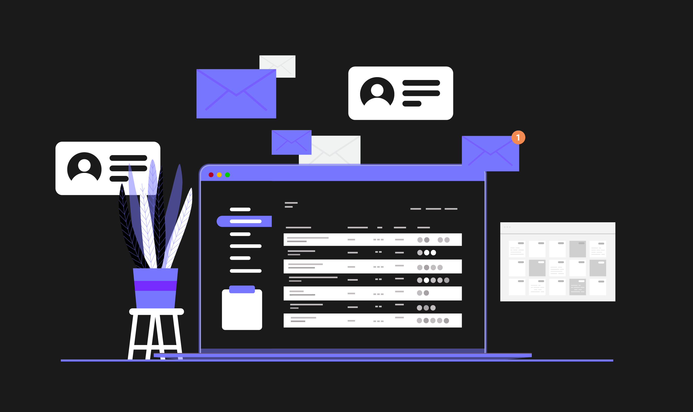
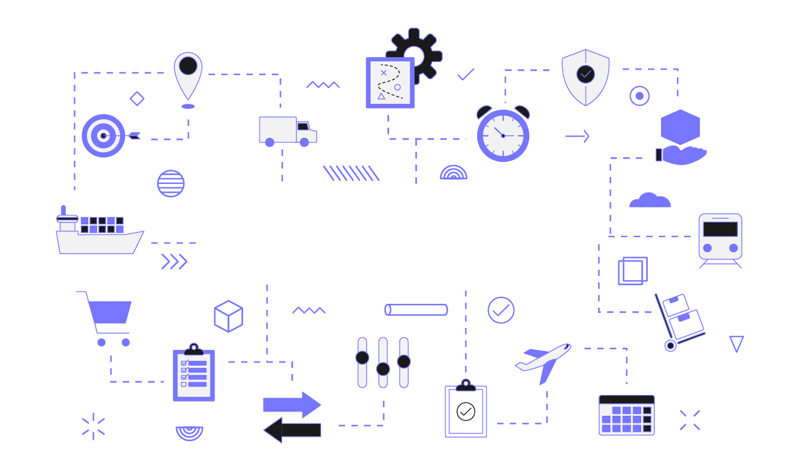

## How does business process automation affect different Canadian industries?

As a business owner, you’re always looking for ways to get rid of hiccups. Maybe you’re struggling with *poor* communication between different departments, or the *slow* onboarding of new employees. **Automation** can eliminate the menial tasks that are causing said hiccups faster than a cold glass of water ever will.

<u>But **what is** business process automation?</u> 

Using advanced technology, including automation programs and process intelligence capabilities, **‘BPA’** can give you a closer **‘ETA’** on your manual tasks. It’s a set of tools that speeds things along. As a Canadian business ourselves serving Burlington, Guelph, Milton, Hamilton, Oakville, Mississauga, Windsor, and other Canadian cities, we know just how important time can be. 

Let’s dive in to how we can save your business the world’s most valuable resource!

## Here are just some of the automation benefits Canadian businesses can enjoy…

### Finance

---

Finance automation uses **software** and **technology** to complete financial processes and operations efficiently. Automating your finances reduces the effort required to complete tasks, **all** while being faster and more **accurate**. Those in the financial sector can automate the following tasks:

<ul>
<li>**Invoicing automation** easily tracks payments, sends invoices and reminders, and generates reports with fewer mistakes and errors.</li>
 
<li>**Payroll systems** that manage wages, deductions, and taxes are automatically calculated when automated. You’ll find fewer errors here as well.</li>

<li>**Payment automation** software makes managing your incoming and outgoing payments simpler.</li>

<li>**Financial reporting** can accumulate data and turn it into a precise, concise report. All of this without human intervention.</li>

<li>**Budgeting and forecasting** have increased accuracy, using historical data and analytics to help predict the future trends of finance.</li>
</ul>

### Human Resources

---

Your human resources department uses many processes that are quick to automate. By streamlining HR processes, most manual tasks can be eliminated, giving your employees more time for key tasks and improving employee satisfaction. More human collaboration, team building, and facilitating company culture is always a good thing.

<ul>
<li> **Applicant tracking and employee onboarding** can be automated – from following their position in the interview process to sending out job offer emails.</li>

<li> **Employee self-service portals** will become central to your organization. Updating personal information, requesting time off, and plenty more can be automated.</li>

<li>**Compliance management** ensures your company is operating within the law including labour laws, permits, licenses, and certifications.</li>

<li>**HR support and service desks** are powered with AI-powered HR chat bots, saving your employees time and bringing them any answers they need swiftly.</li>

<li>**Performance management** collects productivity data, tracks time and attendance, and manages factors such as paid time off. It can even analyze employee burnout.</li>
</ul>

### Supply Chain Management

---

Automating your supply chain management is useful for **preventing errors and inaccuracies** in areas including life sciences, manufacturing, automotive, and technology. In the supply chain field, there is always a degree of uncertainty as interruptions to materials, geopolitical conflicts, and labour shortages slow processes. These processes can all be helped by automation. 

<ul>
<li>**Manufacturing shop floors** can benefit from automated management reports, letting teams stay to course and correct issues in trying times.</li>

<li>**Office administration** becomes easier – supply chain planners can receive eCommerce and point-of-sale analytics in real time.</li>

<li>Much like in the finance industry, **data entry** tasks can be automated, such as those affecting accounts payable and receivables.</li>

<li>**Customer service** is critical to building consumers’ trust: automatically routing calls to the appropriate departments and teams makes their experience that much easier.</li>

<li>**Web portals and automated emails**: sending delivery status updates and providing online portals where customers can check their orders.</li>
</ul>

### Production Lines

---

Automating your production lines turns raw materials and resources into results – all without human intervention. Whether you choose to go all-in with hard, soft, or programmable automation, or start small to see the benefits, you’re sure to enjoy what comes off the line and your bottom line.

<ul>
<li>Is a component much too heavy for a human to pick up? Or un-wieldly and delicate? When it comes to **difficult physical tasks**, automation does all the heavy lifting.</li>

<li>**Repetitive tasks are gone**, letting your staff focus on maintenance and quality assurance over an assembly line.</li>

<li>**Minimizing human errors and injuries** is paramount, with legal costs and challenges also in mind.</li>

<li>**The ROI**, despite an expensive initial investment in equipment, can offer massive returns in time.</li>

<li>**Reduced labour costs** are a benefit, though you will need staff to repair and manage any automated machines.</li>
</ul>

## Can automation help with Enterprise Resource Planning (ERP), too?

Enterprise Resource Planning is an umbrella **encompassing** all the above departments – the **resources** of your company and <u>how they are managed</u>. Automation helps data and information reach where it needs to go between these four departments and many others. Hiring a candidate in the Burlington market through Human Resources involves making financial decisions and managing assets, all which **automation can connect smoothly**.

Another example: you’re a small business in Windsor, Ontario and you’re having difficulty with operational efficiency. It’s taking real money and time away from what matters. An ERP automation solution **integrates functions** across different departments, which will save your business money instead of leading to **time consuming** mistakes. Automation isn’t restricted to large corporations – it’s also beneficial to the **smallest** of businesses.

## Why trust RVB Data Sciences with your Canadian business automation?

---

**RVB Data Sciences** is the first and last stop for any business looking for well-implemented and efficient business automation. It starts with our [Contact Us](/contact#form) page. Reach out to us with your questions, thoughts, and dreams of automation – after all, we’re **not** in the business of causing nightmares! That’s why we’re always an email away.

We offer automated task management services, reducing the need for manual tasks and allowing you to use your resources where they count. It’s **painless** to integrate our business automation with your existing platforms and systems thanks to our API development, too. **Everything is scalable**, meaning our automation features grow with you to ensure efficiency.

**Real-time analytics** means you’ll always be able to examine key data without having to wait. We start our automation mission for your business diligently with a full consultation and in-depth collaborative strategy development. That means **no** surprises down the line, with clear definitions of how we’ll elevate your business.

Choose RVB Data Sciences and you’ll reap the benefits of automation by working with a team that has **more than 10 years of experience** in our craft. Whether you’re located in Burlington, Guelph, Milton, Hamilton, Oakville, Mississauga, Windsor, or elsewhere in Canada, we’re equipped to help you automate. It’s the least we can do for your business!

