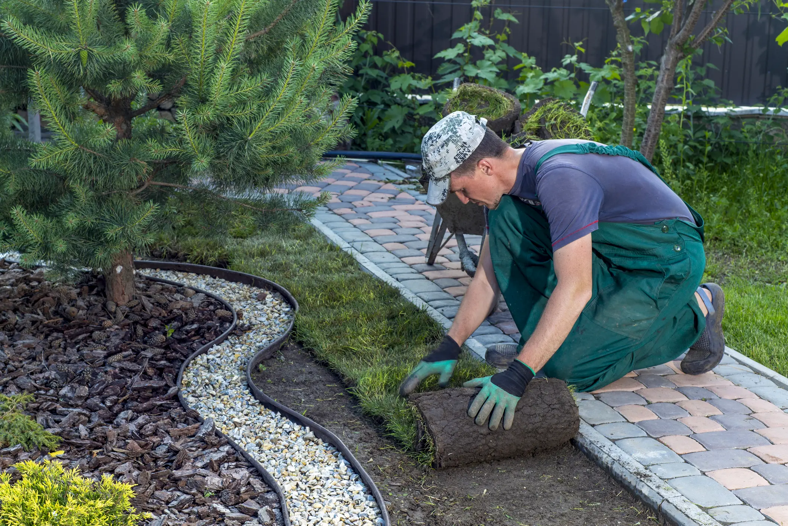

## Introduction

As winter fades and the promise of spring approaches, it’s time for landscaping businesses in the Greater Toronto Area (GTA) to gear up for the busiest season of the year. The competition is fierce, but the opportunities are plentiful. To make sure you’re the one clients call, you need more than great landscaping skills—you need a strong online presence. 

At RVB Data Sciences, we specialize in helping landscapers like you build and maintain a digital foundation that works as hard as you do. Here’s how we can help you get ready for a successful spring season.

## 1. Your Website: A 24/7 Digital Salesperson

---

Your website is the first place most clients will look to learn about your services. It needs to be clear, professional, and tailored to showcase what you do best. Think of it as your online portfolio — complete with photos of your best work, glowing testimonials from happy clients, and a simple list of your services.

	•	Include high-quality photos of your projects. 

	•	Feature glowing testimonials from happy clients. 

	•	Provide a clear list of your services. 

**How RVB Helps**: We design mobile-friendly, visually stunning websites that are optimized for search engines. Your site won’t just look good—it will help turn visitors into paying clients. 

## 2. Be Seen with Local SEO 

---

You know your landscaping services are top-notch, but how do potential clients find you? Local SEO ensures your business appears in search results when someone types “landscapers near me” or “lawn care in Toronto.” This means you’re front and center when homeowners are ready to hire. 

**What RVB Offers**: We optimize your website with local keywords, Google My Business profiles, and geo-targeted strategies so you can stand out in the competitive GTA market.

## 3. Get Clients Fast with Google Ads 

---

Sometimes, waiting for search engine rankings to improve isn’t an option—especially in spring, when every lead counts. Google Ads put your business at the top of search results instantly, targeting the exact clients you want to reach. 

**How RVB Helps**: We manage every aspect of your Google Ads campaigns, from keyword research to ad design. You’ll see your investment turn into leads while you focus on what you do best—creating stunning outdoor spaces.

## 4. Build Authority with Monthly Blogs 

---

Sharing your knowledge through blogs isn’t just about improving SEO—it’s a way to connect with potential clients and show them you’re the expert they can trust. Offer practical advice, like “How to Prepare Your Lawn for Spring” or “Top Landscaping Trends in 2025.” These articles keep your website active and position you as the go-to landscaper in your area. 

**Pro Tip**: Blogs don’t just bring traffic to your website—they help educate clients and build trust before they even pick up the phone.

## Why Choose RVB Data Sciences? 

---

We understand the unique challenges landscaping businesses face in the GTA. That’s why we’ve designed our services to help you grow without adding to your workload. From creating a professional website to managing Google Ads and writing blogs, we handle the technical stuff so you can focus on running your business.

**Let’s Make This Spring Your Best Yet**

This is your season to shine, and RVB Data Sciences is here to help your landscaping business thrive. Whether you’re looking for a new website, better search rankings, or more leads, we have the tools and expertise to help you succeed. 

🌱 Ready to Grow? <a href="/contact">Contact us today</a> and let’s make your digital presence bloom!

