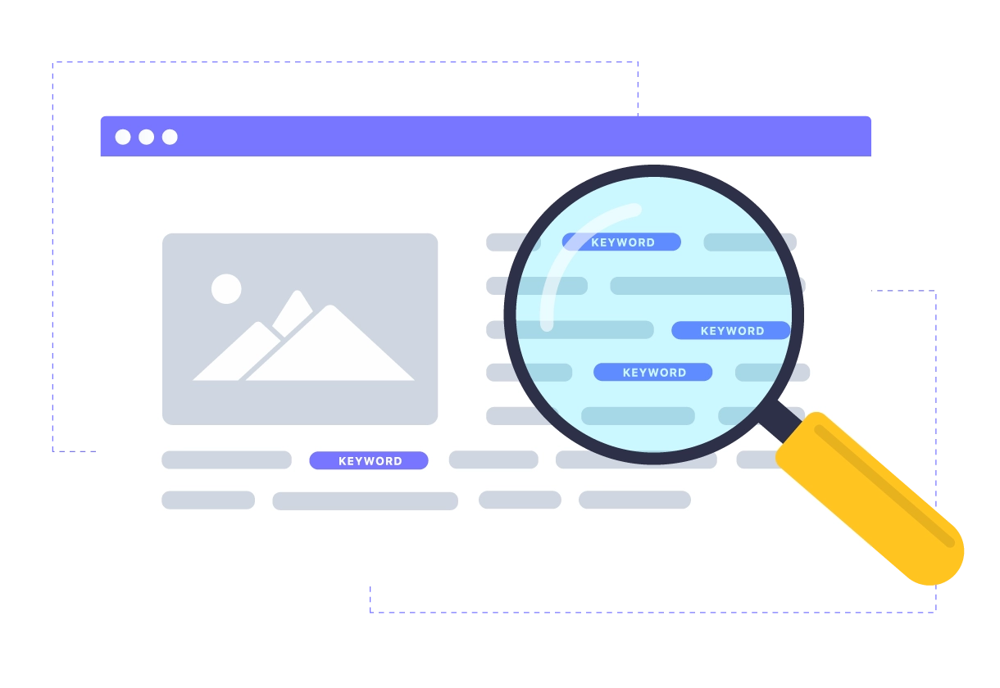

## Introduction

>Hey, I saw you had a sale <u>on Google</u>. Is that still going on?

>I really like the necklace <u>in your ad</u> – is it still available?

>I <u>couldn’t find you online</u> so I came by the store to see what’s new.

**One of these is not like the other**. 

These days, having a presence online for your small business isn’t a choice – it’s a requirement. 
In this blog post, we’ll dive into exactly what SEO is, and three related tactics that help small businesses rank **_higher_**.

## But first… what is SEO?

---
The best tool for a small business to appear in search engines is Search Engine Optimization (SEO) – an umbrella term describing the process of optimizing your website’s content and how your website is constructed with the goal of increasing your visibility and ranking on search engine result pages.

A higher SEO ranking can be achieved, but you’re not going to stay there forever: the key is **constant upkeep**. Your position in a search engine results page is never permanent. You can rank as the first result when someone searches your business for months, or days, or just seconds. [You’ll want RVB Data Sciences to help](https://www.rvbcorp.com/contact).

>Why _would_ you want to increase your ranking in search engines?

**It’s how you’ll grow your business online.**

As massive as the internet is, millions of people use Google Search, Microsoft Bing, and other search engines to discover specific local businesses and services near them. Search engine optimization is how you’ll compete with others in appearing on those search engines in the first place.

With SEO, you can grow brand awareness, making consumers familiar with your products and mission. Given the snowball effect of brand recognition and traffic to your site, SEO can drive sales by introducing **high-quality leads**. Now that we’ve covered what SEO is, here are **three SEO methods to help you rank higher in search engines** and get the online results you deserve.

## Keywords

---

Small businesses benefit from keywords. Specific search queries such as ‘**barbers Burlington**’, ‘**boba tea in downtown Toronto**’, and even ‘**window cleaning Windsor**’ are common to Google – and there are **millions** of results that can appear with a single search query. When you search specific keywords – words like ‘Windsor’, ‘Barber’, and even ‘local’ – you want to see accurate, **relevant** results.

Of course, you’re much more likely to click the first result, let alone the first few. It’s because these businesses are visible and fast to find. **It takes effort** to identify those specific keywords and begin to rank for them, which is made easier by an SEO team, like RVB Data Sciences. That time you would spend working on SEO is better spent navigating your business.

Think of all the different options a consumer searching ‘jewelry’ may find in a search engine. ‘Bespoke jewelry’, ‘jewelry boxes’, and even ‘jewelry repair’ are who you are up against. Take them on from the flank with your own solution. Maybe it’s **localized** or **specialized** keywords. We can manage that and much, much more. 

[Here’s a HubSpot article that sheds some light on why keywords are essential.](https://blog.hubspot.com/marketing/keywords)

Keywords can be placed **strategically** in body copy, blog posts, and more … the list goes on, but the end goal is the same: **to rank in a high position in search engines**, even as the coveted first result. It’s not as simple as just writing content, as there are **millions** of blog posts written every single day. It’s about using integrating keywords smoothly in your content, along with factors like…

## On-Page Optimization and Content Marketing

---

As we’ve discussed, keywords are a <u>massive</u> part of on-page optimization. Placing the **right** keywords in the **right** positions can have amazing results, especially when using other SEO tactics. On the topic of tactics good and bad, keywords should never be stuffed in any area of the site (repeated without rhyme or reason to try and rank higher), as you will instead be penalized due to a poor user experience.

On-Page Optimization is the act of optimizing your website with the keywords mentioned above – only, it’s in a different place than before. That means listing keywords in titles, headings, meta descriptions, URLs, and image alt tags strategically. [Strategy is covered in-depth in this excellent blog post from MOZ.com.](https://moz.com/learn/seo/what-are-keywords#:~:text=Why%20are%20keywords%20important%3F,ready%20to%20make%20a%20purchase.)

On the other side of things is content marketing. While On-Page Optimization is an SEO tactic, Content Marketing is a separate tool that’s intertwined with it. It’s a happy marriage – one that can have stunning results for your small business online. Up-to-date content helps your site rank higher, as does a regular stream of content to your website. 

It’s not just written content – almost **ANYTHING** can be content, after all. Info-graphics, videos, podcasts, and other methods of attracting traffic all count towards your ranking. 

The overall goal is to engage your target audience and show you are an expert in your craft, but improving your site’s SEO ranking is part of doing just that.

## Technical SEO
---

<u>Crawling. Indexing. Rendering. Website architecture.</u> These are the bread and butter of technical SEO – the means of ensuring your website constantly meets the changing **technical requirements** of search engines. You can have a site that’s beautiful, content that’s fresh and well made, and on-page optimization completed, but a website with poor technical SEO is not going to rank well.

**What can you do** to ensure your website is up to date? It’s about making your site easy for search engines to find, crawl, index, and render your website’s pages. Though the requirements are ever changing in the eyes of search engines, having a site that’s optimized for mobile, free of duplicate and repeated content and is quick to load is a good start. There’s a lot to consider here, including the use of JavaScript, 404 pages and 301 redirects, and URL structure.

**Speaking of structure**: sites that have well-organized navigation and architecture will help search engines navigate your site and find your fantastic content – and in turn, rank higher. Blogs and sites with a small number of webpages are less affected, but also consider the usability of the site for your clients and customers. Google is certainly doing the same.

For even more information on SEO guidelines and rules, don’t hesitate to read Brian’s fantastic [Technical SEO: The Definitive Guide’ piece](https://backlinko.com/technical-seo-guide). It’s a full list of everything you’ll need someone to monitor…

## Where do I go from here?

---

If all these factors sound difficult to control, and the art of building an organized, functioning webpage is daunting to you, you’re not alone. *Most* small businesses won’t have the time to manage all these things and their day to day operations. Thankfully, you’re on the right webpage: RVB Data Sciences **specializes** in helping small businesses reach their SEO goals, rank in search engines for specific keywords, and more.

No need to wait on the right time or peace of mind. Navigate to our Contact Us page for more ways to reach us. We’d love to speak with you about how to **reach your small business goals**, including implementing **fresh content** and optimizing your site technically. We’re even here to help you develop and design a brand-new website. It’s the least we can do for a small business looking to navigate the online space and grow their business in a new place!

