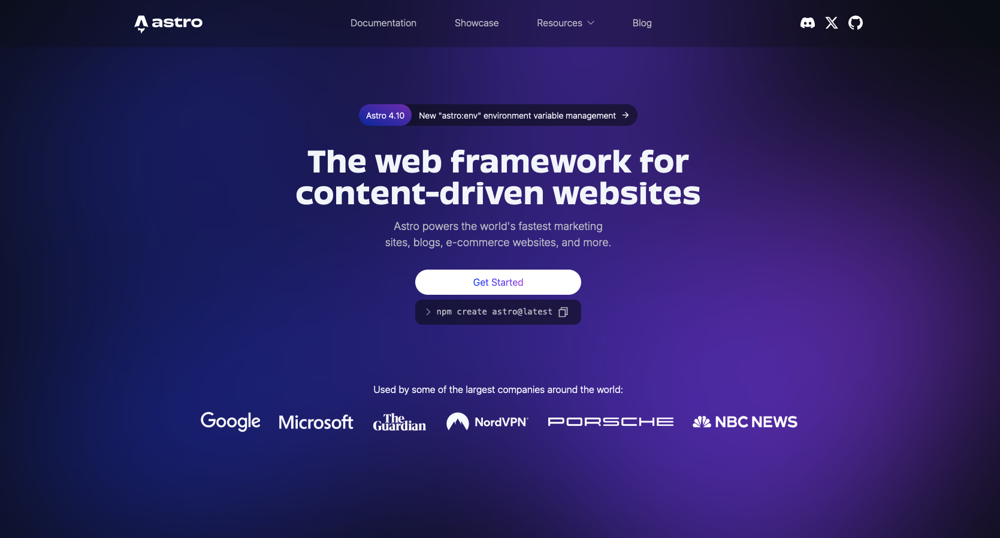
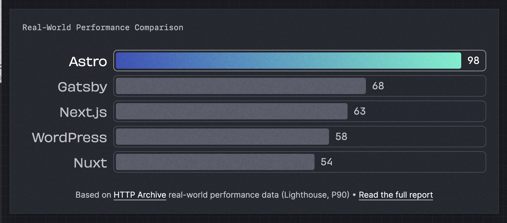

import CallToAction from '~/components/widgets/CallToAction.astro';

## Introduction

We’d say an easy-to-use, open-source content management system (CMS), like WordPress has made waves since its launch in 2003, **but that’s an understatement**. In an ocean like the internet, WordPress powers roughly 43% of all websites.

**That’s roughly 474 million websites!** 

Not bad, considering WordPress started as a blog publishing platform. It’s a CMS success story! [Just check out these usage statistics from WPZoom here.](https://www.wpzoom.com/blog/wordpress-statistics/#:~:text=WordPress%20powers%2043.4%25%20of%20all,over%2030%2C000%20WordPress%20themes%20available)

When it comes to market share, [WordPress holds 62.7 per cent of all CMS platforms](https://w3techs.com/technologies/details/cm-wordpress). In terms of all websites, it still soars past hard-coded HTML sites that and those using other tools. Those hard coded HTML sites, however, certainly serve their purpose. A web framework like Astro comes with its own benefits. That’s why we develop our clients’ websites with WordPress or Astro, depending on their needs. But what are the differences? How do we suggest which to use between the two?

## WordPress

**WordPress**: an open-source personal publishing system that uses an online dashboard and plugins.

---

We’ve discussed the market share of WordPress versus other options, but how does it get ahead in terms of features? Both Astro and WordPress organize a site in ‘blocks’, or **‘components’**, so how different can each be?

Though some consider WordPress clunky and outdated compared to a web framework program like Astro, **WordPress requires no knowledge of coding** for basic use and includes an extremely user-friendly interface for managing a website. 
Its effortless, intuitive visual editor makes loading graphics and content easy. You can drag images into the media library and add them to articles in just a few clicks.

With plenty of user-friendly templates and **plug-ins** (small pieces of code designated for specific tasks), it’s quick to get a basic cookie-cutter site or blog up. There are plug-ins available to help you optimize your content, as per SEO standards. Even more advanced WordPress sites can be created, though coding knowledge may still be required depending on what you are looking to implement.
  
Designing and maintaining your site, as a result, is **much** less time consuming. Both interfaces take time to learn and plenty of trial and error, but WordPress undeniably uses its rigid structure to its advantage here. That said, while WordPress websites are faster to build and launch, a WordPress site is *rarely* faster to browse. 

Depending on the template or plug-in you choose, there can be a lot of **bloat** and items you don’t need or want that will slow down your site. This bloat can also affect SEO, **as website speed is a huge factor** – both for Google accessing your content for ranking, and how long a user is willing to spend waiting for your site to load. According to Sematext, [the likelihood of users leaving your site as it loads increases after waiting longer than just three seconds.](https://sematext.com/glossary/page-load-time/#:~:text=What%20Is%20a%20Good%20Page,of%20visitors%20leaving%20your%20site.)

Want to learn more? [Discover the many other benefits of WordPress here at BlueHost.com](https://www.bluehost.com/blog/8-benefits-of-using-wordpress/?irpid=101&clickid=P61C101S570N0B5578A2D4499E0000V138&utm_campaign=dsa_blog_PPC&utm_source=googleads&utm_medium=genericsearch&channelid=P61C101S570N0B5578A2D4499E0000V113&gad_source=1&gclid=CjwKCAjw65-zBhBkEiwAjrqRMEYmYxz9oSv1ClVU7Cydy_2W8IHfVpeTgws8GNbnAGPfjxP2DrIUPBoC3MYQAvD_BwE&gclsrc=aw.ds)

Working with a team like RVB will ensure your WordPress site is maintained to perform as quickly as it can. More on that later!

## Astro

**Astro**: an open-source HTML-first framework for generating web applications and sites.

---

WordPress may already sound like a winner, but that says nothing about the sheer control and creative freedom allowed by fully coded websites. It’s the **ability** to make a website just how you want it without having to abide by the rules and constraints of WordPress, letting you add advanced features and mix different types of content with ease. It’s great ergonomics for us and a fast-loading website for you – even on slow mobile connections and low-power devices.

Yes, WordPress’ ease of use and hand-holding measures are attractive to many website owners, but it rarely cuts the mustard for businesses looking for speed – as in how fast elements of your site load. But why should you care about speed? Surely a user or consumer who wants to be on your site and interact with your brand will get there some way or another? 

Sure, they will – if they can find it. Website speed and how quickly it loads affects your search engine results page ranking. Website users are more likely to pull up another Google search than to pull out a book and wait!

Astro trims the fat off WordPress’ plugins and extra files and instead focuses on streamlining the experience. If you’re still wanting something relying on themes and templates, Astro even offers options that are far less bloated and slow than the plug-ins and themes you’d find on WordPress.

Why is it so much faster than everything else? Because Astro trims the fat. It renders raw HTML which renders faster on browsers.

---

Astro and WordPress are both content focused, but in a world where [7.5 million blog posts are published daily ](https://masterblogging.com/blog-posts-published-per-day/#:~:text=1.,publish%20more%20posts%20than%20others), you’ll want to be the option that loads quickly. You can discover more about Astro to help you come to a decision with these articles.
- [Consider Astro over WordPress](https://andrewwalpole.com/blog/consider-astro-over-wordpress/)
- [Migrate to Astro from WordPress](https://docs.astro.build/en/guides/migrate-to-astro/from-wordpress)
- [Getting Started with Astro](https://semaphoreci.com/blog/astro-framework#:~:text=What%20is%20Astro%3F,composed%20of%20several%20independent%20components)

The downside to Astro is that you’ll need to know **how to code a website** – not a skill in the tool-belt of many business owners and bloggers! Thankfully, that’s something of a specialty for our team…

## 
Why choose RVB?

---

Once a website is finished and loaded, it’ll need to be maintained – content will need to be updated regularly, the **technical framework** behind each site will need to be kept in good shape, and any drops or interruptions in service will require effort to bring back online. It’s unavoidable, <u>whether</u> you’re looking for a simple WordPress site or a custom-built e-commerce site.

If that’s all giving you a headache, **turn to the team at RVB**. We’re here to help businesses rank and perform with web development solutions **tailored** to our clients’ needs. Every one of our websites is mobile-responsive, meaning it’ll look just as good on the smartphone market.

Brand integration, UX/UI design, performance optimization, e-commerce configuration, and search engine optimization solutions are just some of the services we provide. No matter how you’d like to expand your business online, RVB is here to help you with it.

Send us a message via our [Contact](/contact#form) page or drop us an email at [info@rvbcorp.com](mailto:info@rvbcorp.com). We’re excited to bring you a quality website that delivers.

<CallToAction
    actions={[
        {
            text: 'Contact Us',
            href: '/contact#form',
            target: '_self',
            variant: 'primary',
        },
        ]}
    >
        <Fragment slot="title">
          Ready to Transform Your Business?
        </Fragment>

        <Fragment slot="subtitle">
          Let’s build something amazing together. 
          Contact us today to discuss your project and discover how we can help you achieve your goals.
        </Fragment>

  </CallToAction>